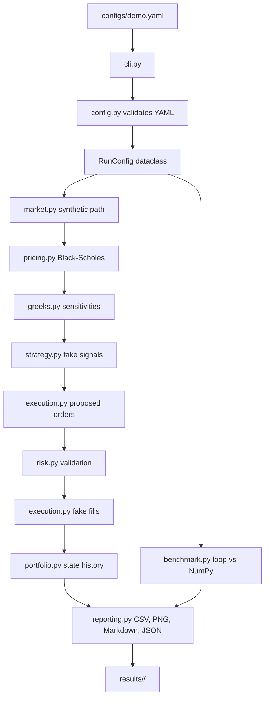

# PyRiskLab Architecture

PyRiskLab is a local Python simulation engine for options pricing and portfolio risk analysis. It is designed as a command-line engineering tool, not a SaaS app, trading bot, or live brokerage integration.

## Why Local First

The project is aimed at software engineering portfolio value: deterministic runs, readable code, tests, reproducible outputs, and performance-aware numerical computing. Keeping the project local avoids accounts, APIs, cloud deployment, databases, market-data licensing, and broker integration.

## Why CLI Instead Of Dashboard

The MVP uses a CLI because one command is easy to run, easy to document, and easy to test:

```bash
python -m pyrisklab run --config configs/demo.yaml --overwrite
```

A dashboard would be visually nice, but it would distract from the core Python engineering signal. For Version 1, Markdown reports and PNG charts are enough.

The CLI remains thin: it parses flags, toggles progress output with `--quiet`, exposes `--debug` for traceback output during development, and delegates orchestration to `pipeline.py`.

## Why CSV, Markdown, And PNG

Each run generates a small, inspectable artifact set. CSV files are easy to open in pandas, VS Code, Excel, or GitHub. Markdown reports are readable without a browser app. PNG charts are useful for README screenshots and reviewer demos. A database would add setup cost without improving the MVP.

## Deterministic Configs

Runs start from `configs/demo.yaml`. The config controls the run name, seed, market assumptions, option contract, strategy thresholds, risk limits, execution settings, and benchmark size. The same config and seed are intended to produce the same simulated path and outputs.

Config validation happens before simulation work begins. Numeric, finite-value, integer, boolean, enum, output-path, and range checks raise field-specific `ConfigError` messages so user mistakes fail early and do not leak into pricing, portfolio, risk, or reporting code.

## Data Flow



```text
configs/demo.yaml
  -> config.load_config()
  -> RunConfig dataclass
  -> market.simulate_gbm_path()
  -> pricing.price_market_path()
  -> greeks.calculate_greeks_for_market_path()
  -> strategy.generate_signals()
  -> execution.create_orders_from_signals()
  -> risk.RiskManager.validate_order()
  -> execution.execute_orders()
  -> portfolio.build_portfolio_history()
  -> benchmark.run_pricing_benchmark()
  -> reporting.generate_reports()
  -> results/<run_name>/
```

## Module Responsibilities

- `cli.py`: parses arguments, prints clean progress/errors, and keeps tracebacks behind `--debug`.
- `config.py`: loads YAML and validates inputs.
- `models.py`: dataclasses for configs, orders, trades, positions, snapshots, risk events, and benchmark results.
- `market.py`: generates synthetic GBM price paths.
- `pricing.py`: implements Black-Scholes pricing.
- `greeks.py`: calculates Delta, Gamma, Vega, Theta, and Rho.
- `strategy.py`: generates deterministic fake buy/sell/hold signals.
- `execution.py`: creates simulated orders and deterministic fake fills.
- `portfolio.py`: tracks cash, position quantity, P&L, total value, and drawdown.
- `risk.py`: blocks orders that violate configured limits.
- `benchmark.py`: compares Python-loop pricing with vectorized NumPy pricing.
- `reporting.py`: writes CSVs, charts, config copy, and Markdown summary.
- `pipeline.py`: orchestrates the end-to-end run.

## Stateful Vs Pure

Pricing, Greeks, market simulation, and benchmarking are mostly pure functions. `Portfolio` owns cash, positions, realized P&L, peak value, and snapshots. `RiskManager` owns risk events and the stop-trading flag. The CLI and reporting layers do not own simulation state.

Stateful domain objects also protect their own invariants. For example, `Portfolio` rejects invalid cash, multiplier, quantity, price, commission, and short-sale transitions even though earlier config and risk layers validate normal inputs.

Execution follows the same pattern: the fake execution function rejects unsupported fill models, non-finite commissions, invalid multipliers, invalid quantities, and bad fill prices before producing trade rows. `RiskManager` also validates its contract multiplier before calculating proposed trade notional.

## Why Vectorization Matters

The pricing benchmark compares a Python loop against vectorized NumPy for the same generated Black-Scholes inputs. `BenchmarkResult` rows include pricing assumptions, runtime, speedup, max absolute error, and the equivalence-check flag so `benchmark.csv` is auditable without reading source code. The goal is honest measurement: prove that implementation choices matter, verify numerical equivalence, and report machine-dependent speedup without exaggeration.

## Out Of Scope

PyRiskLab intentionally avoids live market APIs, brokerage connections, real order execution, databases, Docker, cloud deployment, dashboards, user accounts, payments, ML trading prediction, and profitability claims.
